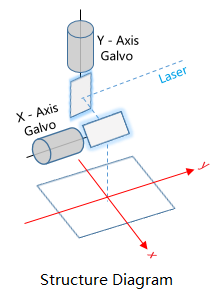
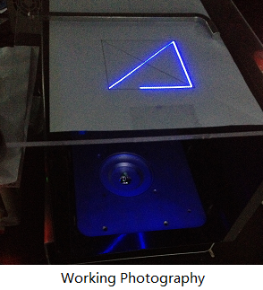

# 2D Laser Printer Firmware

This is an experimental project to realize 2D laser printing based on [Marlin project](https://github.com/MarlinFirmware/Marlin) , an open source FDM(Fused Deposition Modeling) 3D printer.

Only the 2D laser printing part is realized, not the complete SLA(Stereo Lithography Appearance) 3D printing. 

## SLA  Printing  vs  FDM Printing

- Size:   FDM > SLA

- Precision: SLA > FDM

- Cost:   SLA > FDM

  The high precision of SLA printing can make the finished product smoother, but it will limit the size of the finished product, and also increase the cost.

## Sketch
       

## Galvanometer Scanner

2 galvanometer scanners are used as the x-axis and y-axis motorized components which performs the horizontal scanning on 2D plane.

The galvanometer scanner is driven by the analog chip AD5322, which is a 12-bit DAC that accepts command via SPI. See [datasheet](./docs/Galvo_AD5322_Datasheet.pdf) for more specifications.

## Related Project

See [Marlin_3D_Printer](https://github.com/hathatehack/Marlin_3DPrinter) for more information.

## License

Marlin is published under the [GPL license](https://github.com/COPYING.md) because we believe in open development. The GPL comes with both rights and obligations. Whether you use Marlin firmware as the driver for your open or closed-source product, you must keep Marlin open, and you must provide your compatible Marlin source code to end users upon request. The most straightforward way to comply with the Marlin license is to make a fork of Marlin on Github, perform your modifications, and direct users to your modified fork.

While we can't prevent the use of this code in products (3D printers, CNC, etc.) that are closed source or crippled by a patent, we would prefer that you choose another firmware or, better yet, make your own.